University: [ITMO University](https://itmo.ru/ru/) \
Faculty: [FICT](https://fict.itmo.ru) \
Course: [Introduction to distributed technologies](https://github.com/itmo-ict-faculty/introduction-to-distributed-technologies) \
Year: 2023/2024 \
Group: K4113с \
Author: Zenkevich Dmitrii Evgenyevich \
Lab: Lab1 \
Date of create: 25.10.2023 \
Date of finished: <none>

# Настройка окружения
В первую очередь необходимо установить docker и minikube.
Проверяем что docker и minikube установились с помощью команд:

`` docker --version ``

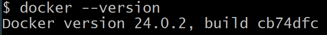

`` minikube version ``

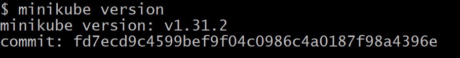

Далее скачиваем image докер-контейнера с помощью команды:

`` docker pull vault:1.13.3  ``

Проверяем, что image установился с помощью команды:

`` docker images  ``

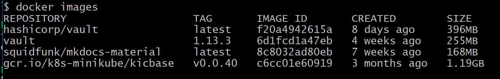

# Запуск minikube
Стартуем minikube с помощью команды:

``minikube start``

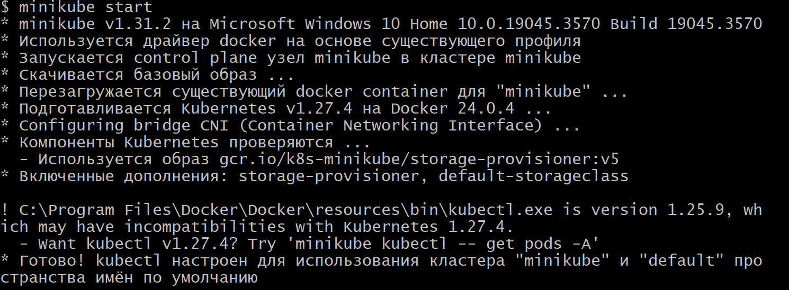

# Создание пода
Чтобы создать под применяем манифест с помощью команды:

``minikube kubectl -- apply -f vault-manifest.yaml``

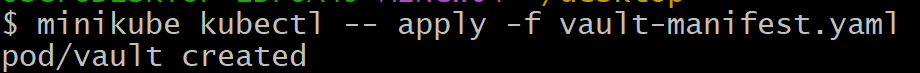

# Создание сервиса
Создадим сервис для доступа к созданному контенеру с помощью команды:

``minikube kubectl -- expose pod vault --type=NodePort --port=8200``

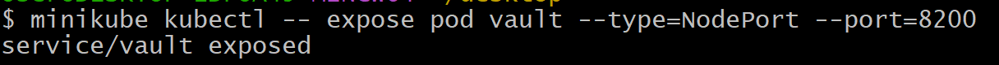

# Доступ к поду
Прокинем порт компьютера в контейнер с помощью команды:

``minikube kubectl -- port-forward service/vault 8200:8200``

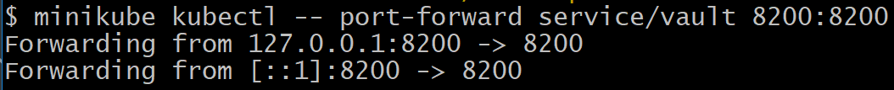

Попробуем подключиться к контейнеру по адресу:

``http://localhost:8200``

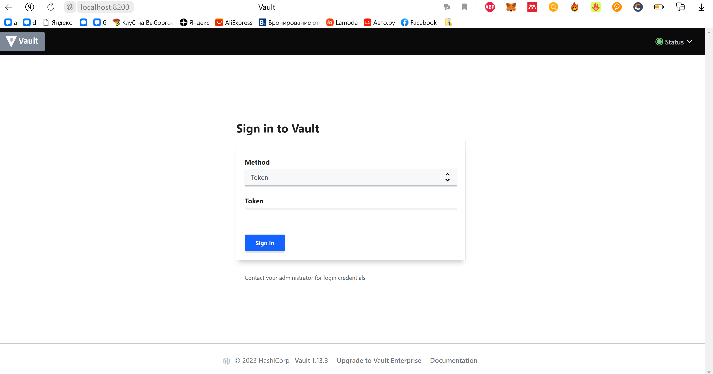

Найдем root-token в логах для аутентификации с помощью команды:

``minikube kubectl -- logs vault``

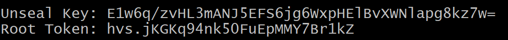

Теперь можно зайти в приложение:

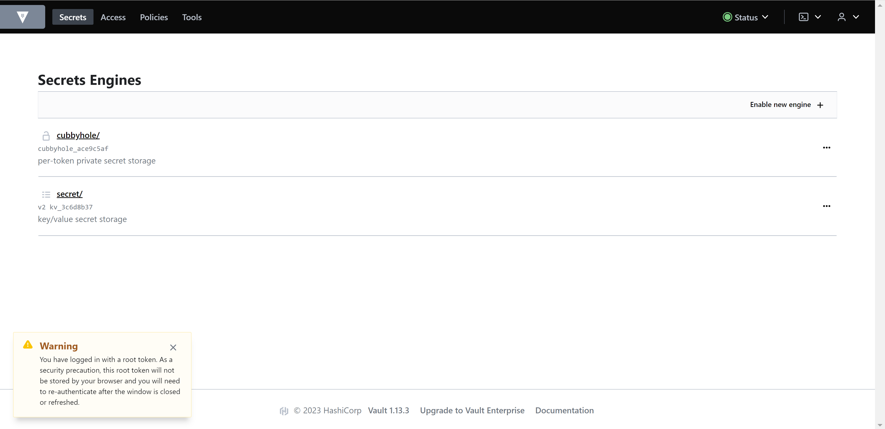

# Остановка кластера

Для остановки кластера воспользуемся командой:

``minikube stop``

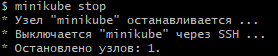

# Диаграмма системы

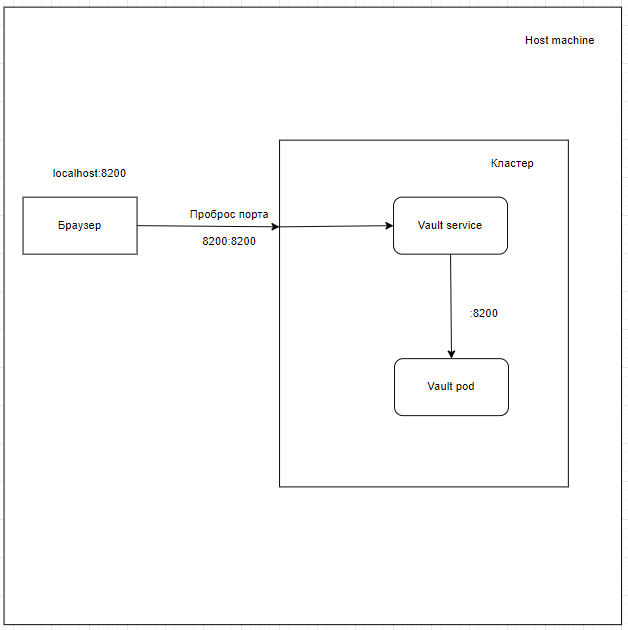