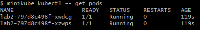

University: [ITMO University](https://itmo.ru/ru/) \
Faculty: [FICT](https://fict.itmo.ru) \
Course: [Introduction to distributed technologies](https://github.com/itmo-ict-faculty/introduction-to-distributed-technologies) \
Year: 2023/2024 \
Group: K4113с \
Author: Zenkevich Dmitrii Evgenyevich \
Lab: Lab2 \
Date of create: 31.10.2023 \
Date of finished: <none>

# Скачивание image контейнера
Для скачивания image воспользуемся командой:

```bash
docker pull ifilyaninitmo/itdt-contained-frontend:master
```


Проверим наличие image с помощью команды:

```bash
docker images
```


# Создание манифеста
Согласно заданию напишем манифест объекта deployment с:
1) Приложение: itdt-contained-frontend
2) name: lab2
3) replicas: 2
4) env:
   - name: REACT_APP_USERNAME
   value: REACT_APP_USERNAME
   - name: REACT_APP_COMPANY_NAME
   value: REACT_APP_COMPANY_NAME

Применим манифест с помощью команды:

```bash
minikube kubectl -- apply -f deployment.yaml
```


Проверим наличие деплоймента и подов с помощью команд:

```bash
minikube kubectl -- get deployment
```

```bash
minikube kubectl -- get pods
```




```bash
minikube kubectl -- expose deployment/lab2 --type=NodePort --port=3000
```


# Проверка работы

Пробросим порт с помощью команды:

```bash
minikube kubectl -- port-forward service/lab2 8200:3000
```


Попробуем открыть приложение по адресу http://localhost:8200.


На сайте отображаются значения env-переменных и имя контейнера, на который мы попали.

Env-переменные неизменны, так как они применяются ко всем созданным контейнерам.

Имя контейнера может меняться в зависимости от того на какой контейнер придет запрос.

Логи можно посмотреть с помощью комманд:

```bash
minikube kubectl -- logs lab2-797d8c498f-xzwps
minikube kubectl -- logs lab2-797d8c498f-xwdcg
```


# Диаграмма


