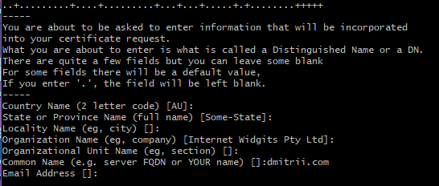
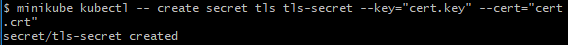
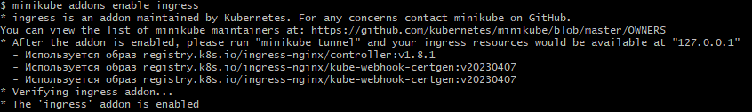
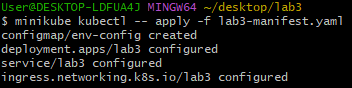
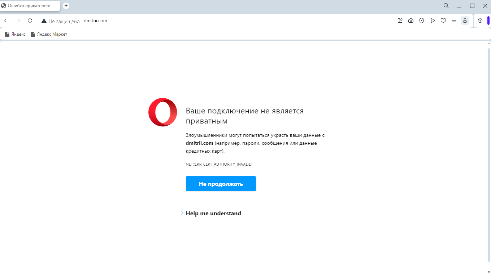
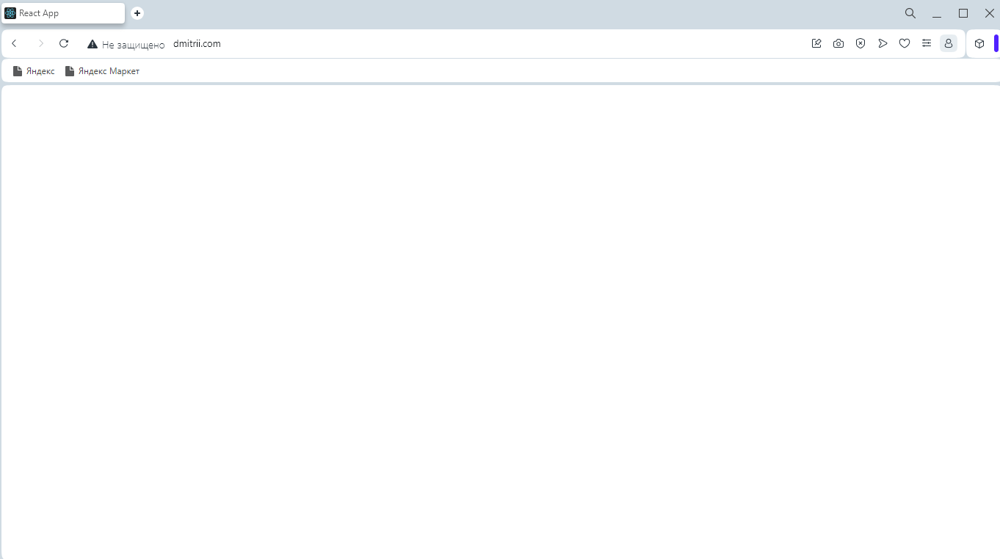
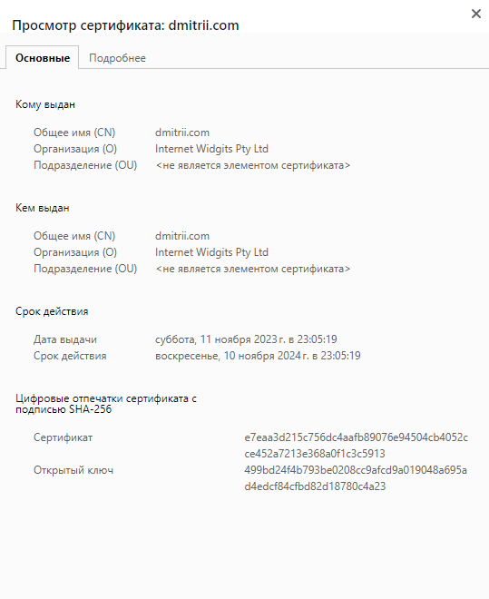
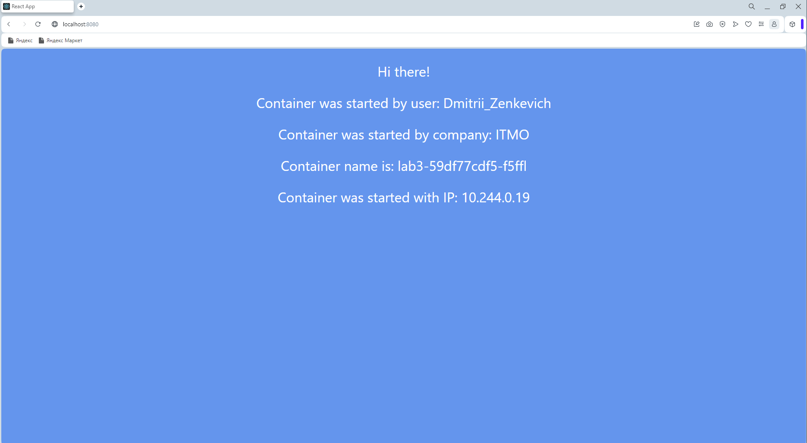
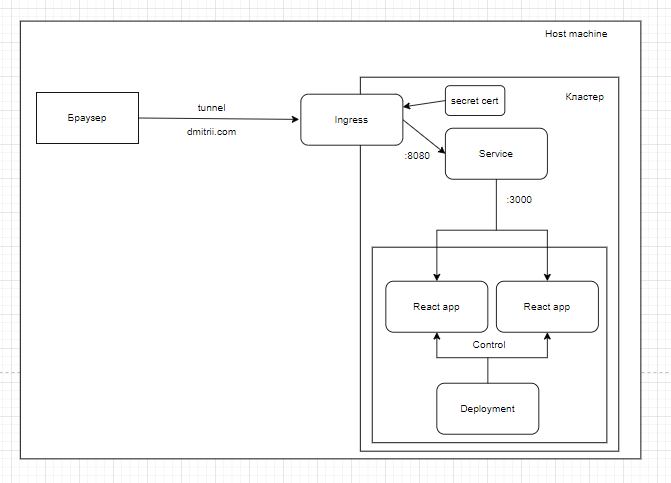

University: [ITMO University](https://itmo.ru/ru/) \
Faculty: [FICT](https://fict.itmo.ru) \
Course: [Introduction to distributed technologies](https://github.com/itmo-ict-faculty/introduction-to-distributed-technologies) \
Year: 2023/2024 \
Group: K4113с \
Author: Zenkevich Dmitrii Evgenyevich \
Lab: Lab3 \
Date of create: 01.11.23 \
Date of finished: <none>

# Создание ConfigMap, Deployment и Service

Создаем объект ConfigMap:

```yaml
apiVersion: v1
kind: ConfigMap
metadata:
  name: env-config
data:
  REACT_APP_USERNAME: Dmitrii_Zenkevich
  REACT_APP_COMPANY_NAME: ITMO
```
В объекте Deployment по сравнению с предыдущими лабораторными необходимо заменить секцию ``env`` на ``envForm``

```yaml
containers:
        - name: lab3
          image: ifilyaninitmo/itdt-contained-frontend:master
          ports:
            - containerPort: 3000
          envFrom:
            - configMapRef:
                name: env-config
```
Объект Service создаем аналогично предыдущим лабораторным работам

# Генерация TLS сертификата и создание Secret

Для генерации воспользуемся командой openssl:

```bash
openssl req -new -newkey rsa:4096 -x509 -sha256 -days 365 -nodes -out cert.crt -keyout cert.key
```
При заполнении обязательно необходимо заполнить поле ``Common Name``, в котором нужно указать доменное имя, по которому 
будем ходить в Ingress. В моем случае это ``dmitrii.com``:



Далее создаем secret c помощью команды:

```bash
minikube kubectl -- create secret tls tls-secret --key="cert.key" --cert="cert.crt"
```



# Создание Ingress

Чтобы подключить ingress необходима следующая команда:

```bash
minikube addons enable ingress
```



Здесь обращаем внимание на следующий момент:

`` After the addon is enabled, please run "minikube tunnel" and your ingress resources would be available at "127.0.0.1"``

После чего применяем манифест, в котором описаны все вышеперечисленные объекты и ingress:

```bash 
minikube kubectl -- apply -f lab3-manifest.yaml
```



# Подключение к приложению

Первым делом необходимо смаппить ip, по которому доступен ingress с нашим доменным именем.
Для этого нужно прописать в файле hosts следующее (работа ведется из консоли git bash, консоль нужно открыть
от имени администратора):

```bash
echo "127.0.0.1 dmitrii.com" | tee -a /c/Windows/System32/drivers/etc/hosts
```

Поскольку работа ведется в os windows, для доступа к ingress необходимо использовать команду:

```bash
minikube tunnel
```

После этого можно пробовать ходить в наше приложение по адресу ``https://dmitrii.com``

При этом браузер ругается на самописные сертификаты:



Чтобы браузер пропустил нас к нашему приложению, нужно прямо на этой странице набрать ``thisisunsafe``
(прямо на клавиатуре на этой странице, не нужно заходить в консоль разработчика)

Получаем следующий результат:



Доступ появился, но страница не прогружается. Это связано с промблемой веб-приложения react, называемой [**CORS**](https://www.telerik.com/blogs/all-you-need-to-know-cors-errors),
которую я не могу исправить.

Посмотрим данные сертификата:



Для того чтобы проверить, что переменные окружения взялись из конфигмапы, попробуем подключиться напрямую через сервис пробросив порт:

```bash
 minikube kubectl -- port-forward service/lab3 8080:8080
```

В результате видим, что переменные окружения подтянулись:



# Схема 

