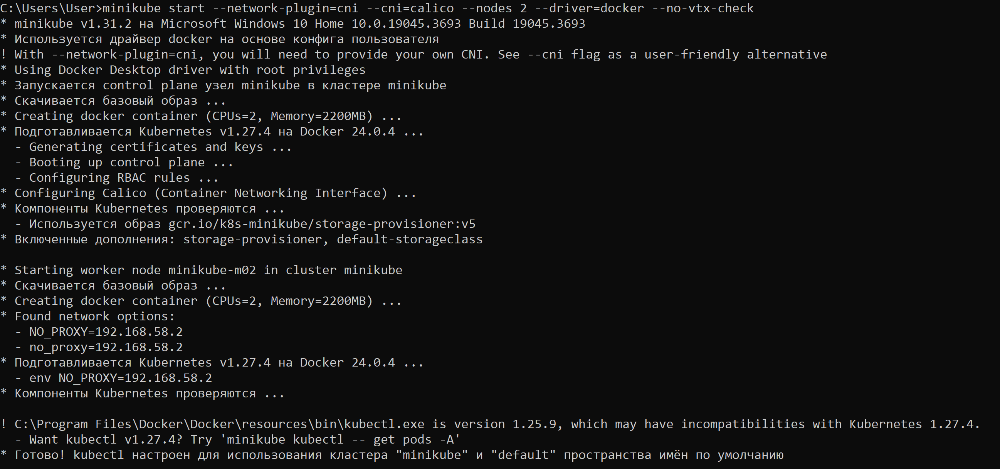
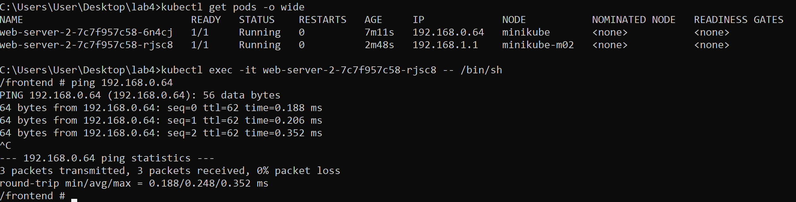

University: [ITMO University](https://itmo.ru/ru/) \
Faculty: [FICT](https://fict.itmo.ru) \
Course: [Introduction to distributed technologies](https://github.com/itmo-ict-faculty/introduction-to-distributed-technologies) \
Year: 2023/2024 \
Group: K4113с \
Author: Zenkevich Dmitrii Evgenyevich \
Lab: Lab4 \
Date of create: 11.11.2023 \
Date of finished: <none>

# Создание двухнодового кластера
Поскольку устал мучиться с git bash - переезжаем в консоль shell


Создадим кластер из двух нод с помощью следующей команды:

```bash
minikube start --network-plugin=cni --cni=calico --nodes 2 --driver=docker --no-vtx-check
```



# Конфигурация calico

Конфигурируем calico с помощью манифеста:

```bash
kubectl apply -f config.yaml
```


Удаляем дефолтный ippool:

```bash
kubectl exec -i -n kube-system calicoctl -- /calicoctl get ippool --allow-version-mismatch
kubectl exec -i -n kube-system calicoctl -- /calicoctl delete ippools default-ipv4-ippool --allow-version-mismatch
```


Создаем ippool манифест:

```yaml
apiVersion: projectcalico.org/v3
kind: IPPool
metadata:
  name: spb-ippool
spec:
  cidr: 192.168.0.0/24
  ipipMode: Always
  natOutgoing: true
  nodeSelector: name == "spb"
---
apiVersion: projectcalico.org/v3
kind: IPPool
metadata:
  name: msk-ippool
spec:
  cidr: 192.168.1.0/24
  ipipMode: Always
  natOutgoing: true
  nodeSelector: name == "msk"
```
Назначим лейблы:
```bash
kubectl label nodes minikube name=spb
kubectl label nodes minikube-m02 name=msk
```


# Создание манифеста Configmap, Deployment и Service

Создадим и применим манифест конфигмапы, деплоймента и сервиса

```yaml
apiVersion: v1
kind: ConfigMap
metadata:
  name: env-config
data:
  REACT_APP_USERNAME: Dmitrii_Zenkevich
  REACT_APP_COMPANY_NAME: ITMO

---

apiVersion: apps/v1
kind: Deployment
metadata:
  name: web-server-2
  labels:
    app: web-server-2
spec:
  replicas: 2
  selector:
    matchLabels:
      app: web-server-2
  template:
    metadata:
      labels:
        app: web-server-2
    spec:
      containers:
        - name: web-server-2
          image: ifilyaninitmo/itdt-contained-frontend:master
          ports:
            - containerPort: 3000
          envFrom:
            - configMapRef:
                name: env-config
      affinity:
        podAntiAffinity:
          requiredDuringSchedulingIgnoredDuringExecution:
            - labelSelector:
                matchExpressions:
                  - key: app
                    operator: In
                    values:
                      - web-server-2
              topologyKey: "kubernetes.io/hostname"

---

apiVersion: v1
kind: Service
metadata:
  name: web-server-service-2
spec:
  selector:
    app: web-server-2
  ports:
    - protocol: TCP
      port: 8080
      targetPort: 3000
```
Секция `affinity` нужна для гарантии того, что поды будут развернуты на обе ноды.


Выведем информацию о пулах ip:

```bash
kubectl exec -i -n kube-system calicoctl -- /calicoctl get ippool -o wide   --allow-version-mismatch
```


# Доступ к сервису

Пробрасываем порт:

```bash
kubectl port-forward service/web-server-service-2 8080:8080
```
Пробуем зайти по локалхосту:


Получим IP одного из контейнеров и пропингуем из другого

```bash
kubectl get pods -o wide
kubectl exec -it web-server-2-7c7f957c58-rjsc8 -- /bin/sh
ping 192.168.0.64
```



# Диаграмма

